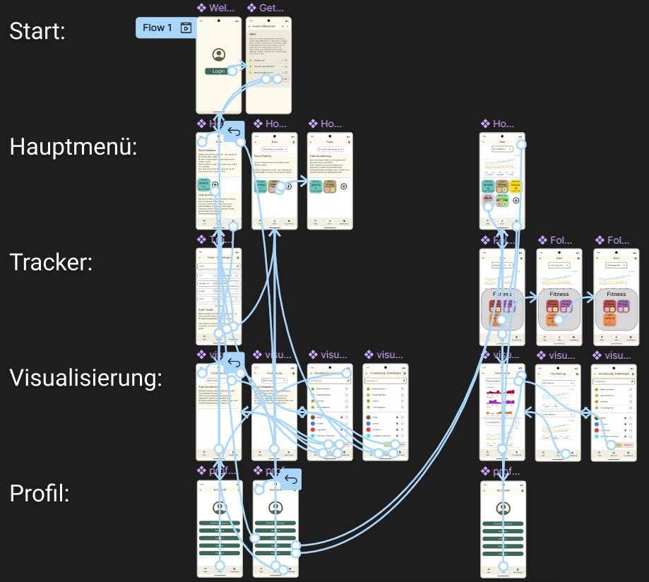

# Data Tracker PWA

### *My First PWA Project – Open for Feedback!*
This is my first attempt at building a **Progressive Web App (PWA)**, so while I try to follow best practices, I am sure there might be areas for improvement. Also, the app is not finished yet, but if I have enough time in the future, I may continue working on it. This project started as part of a university course where I initially created an app prototype using **Figma**. When the course ended, I realized that this app had great potential, so I decided to continue and turn the prototype into a fully functional PWA. 

If you have any **best practices, feedback, or suggestions**, I would greatly appreciate them! Additionally, you can try the app **directly in your browser** or **install it** on your device via **GitHub Pages**: 
👉 [Live Demo on GitHub Pages](https://badurac.github.io/data-tracker-pwa)

---

A **Progressive Web App (PWA)** for tracking various data points using counters and time trackers. Built with **React**, **Material-UI**, and **IndexedDB** for local data storage.

## 🚀 Features

- **Counter Trackers**: Track counts with increment and decrement functionality.
- **Time Trackers**: Track elapsed time with start, pause, stop, and reset functionality.
- **Data Persistence**: Data is stored locally using **IndexedDB**.
- **Responsive Design**: Works across various screen sizes.
- **Customizable Theme**: Users can change the app's color theme; maybe later, I will add more customizations like different tracker designs.
- **PWA Support**: Installable on mobile devices and desktops.
- **Analytics Dashboard**: View tracked data with visual charts (using Recharts).

---

## 📂 Project Structure

```
/data-tracker-pwa
├── public/                 # Static files
│   ├── index.html          # Main HTML file
│   ├── manifest.json       # PWA metadata
│   └── icons/              # App icons
│
├── src/                    # Source code
│   ├── components/         # UI components
│   │   ├── AddButton.js
│   │   ├── ButtonGrid.js
│   │   ├── CounterTrackerButton.js
│   │   ├── TimeTrackerButton.js
│   │   ├── Modal.js
│   │   ├── Header.js
│   │   ├── Footer.js
│   ├── pages/              # App pages
│   │   ├── Home.js
│   │   ├── Analytics.js
│   │   ├── Goals.js
│   │   ├── ProfilePage.js
│   │   ├── LoginPage.js
│   ├── utils/              # Utility functions
│   │   ├── db.js           # IndexedDB helper functions
│   ├── App.js              # Main React component
│   ├── index.js            # App entry point
│   ├── index.css           # Global styles
│   ├── reportWebVitals.js  # Performance metrics
│   ├── setupTests.js       # Test setup
│
├── .gitignore              # Files to ignore in Git
├── package.json            # Dependencies and scripts
├── README.md               # Project documentation
└── LICENSE                 # License file
```

---

## 📷 Figma Prototype
Here are some images and a video from the **original prototype**, which was created in **Figma** before being developed into this PWA:

### **Screenshots:**



### **Prototype Walkthrough Video:**
[Prototype video](documentation/DatraVideo.mp4)

These resources illustrate the design ideas and user interface before implementation. The goal was to make the transition from **design to functional PWA** as simle as possible.

---

## 🛠️ Technologies Used

- **React** - JavaScript library for building UI components.
- **Material-UI** - Pre-built UI components for a modern look.
- **IndexedDB** - Client-side database for offline data storage.
- **React Router** - Navigation and routing for React applications.
- **Recharts** - Visualization library for analytics and graphs.
- **Service Workers** - PWA features for offline functionality.

---

## 🔧 Installation & Setup

To set up the project locally, follow these steps:

```bash
# Clone the repository
git clone https://github.com/badurac/data-tracker-pwa.git
cd data-tracker-pwa

# Install dependencies
npm install
```

### Available Scripts

#### **1. Start Development Server**
```bash
npm start
```
Runs the app in development mode. Open [http://localhost:3000](http://localhost:3000) to view it in the browser.

#### **2. Run Tests**
```bash
npm test
```
Launches the test runner in interactive watch mode.

#### **3. Build for Production**
```bash
npm run build
```
Creates a production build of the app.

---

### Deploy to GitHub Pages:
1. Install `gh-pages`:
    ```bash
    npm install --save-dev gh-pages
    ```
2. Add the following in `package.json`:
    ```json
    "homepage": "https://your-username.github.io/data-tracker-pwa",
    "scripts": {
      "predeploy": "npm run build",
      "deploy": "gh-pages -d build"
    }
    ```
3. Deploy:
    ```bash
    npm run deploy
    ```
4. **Try the Live Demo**: [https://your-username.github.io/data-tracker-pwa](https://your-username.github.io/data-tracker-pwa)


---

## 📜 License

This project is licensed under the **MIT License**. See the [LICENSE](LICENSE) file for details.

---

## 📩 Contact

For any inquiries, tips, or suggestions for improvement, feel free to contact me:
- **Mail** - [collinmueller97@googlemail.com](mailto:collinmueller97@googlemail.com)
- **GitHub** - [github.com/badurac](https://github.com/badurac)

---

### 🎯 Happy Tracking! 🚀
